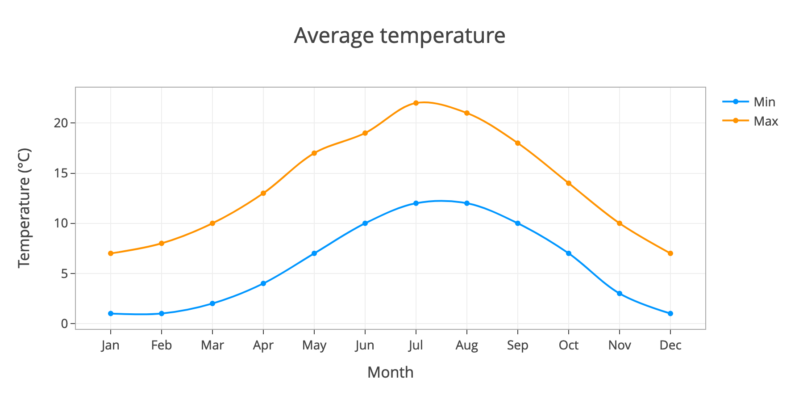

# Wagtail-Plotly

Create charts in Wagtail using Plotly. This is project is in Alpha, so expect breaking changes!


[Some more examples](docs/examples.md)

## Installation

Install from [PyPI](https://test.pypi.org/project/wagtail-plotly/):

```
pip install wagtail-plotly
```

Then add the following to your project's `INSTALLED_APPS`.

```
'wagtail.contrib.table_block',
'generic_chooser',
'wagtail_color_panel',
'wagtail_plotly',
```

## Out of the box

There are currently several plot blocks that are ready to use:

* [BarChartBlock / LinePlotBlock](docs/bar_and_line.md)
* [ContourPlotBlock / HeatmapPlotBlock](docs/contour_and_heatmap.md)
* [PieChartBlock](docs/pie.md)
* [ScatterPlotBlock](docs/scatter.md)

Each plot block has a number of trace/layout fields appropriate to its type.

### Example use

 One way of using it is to create a `StreamBlock`:

```python
from wagtail.core import blocks

from wagtail_plotly.blocks.plot import (
    BarChartBlock,
    ContourPlotBlock,
    HeatmapPlotBlock,
    LinePlotBlock,
    PieChartBlock,
    ScatterPlotBlock,
)

class MyStreamBlock(blocks.StreamBlock):
    bar_chart = BarChartBlock()
    contour_plot = ContourPlotBlock()
    heatmap_plot = HeatmapPlotBlock()
    line_plot = LinePlotBlock()
    pie_chart = PieChartBlock()
    scatter_plot = ScatterPlotBlock()
```

Add the `StreamBlock` to a `StreamField` on a Wagtail page:

```python
from wagtail.admin.edit_handlers import StreamFieldPanel
from wagtail.core.fields import StreamField
from wagtail.core.models import Page

from .blocks import MyStreamBlock


class MyPage(Page):

    body = StreamField(MyStreamBlock(), null=True)

    content_panels = Page.content_panels + [
        StreamFieldPanel('body'),
    ]
```
Then in the page template:

```



```

## Build your own

The plots in `wagtail-plotly` are based around a set of base block classes, that can be extended to create your own plots. The intention is to allow custom layouts and trace config whilst handling the data input. The base classes are:

* BaseBarChartBlock
* BaseContourPlotBlock
* BaseHeatmapPlotBlock
* BaseLinePlotBlock
* BasePieChartBlock
* BaseScatterPlotBlock

Each base block class inherits from `BasePlotBlock`. All of the blocks have a `plot_data` field for entering plot data (based on `wagtail.contrib.table_block`) and `build_data` method for extracting data from the table ready for plotting.

### Creating new plot blocks

New plot blocks can be created by inheriting from a base plot. The `get_trace_fields` and `get_layout_fields` methods can be used to pass any additional fields to the Plotly `update_traces` and `update_layout` methods respectively.

**Note:** It's important that the field names are based on parameters that Plotly knows about, see https://plotly.com/python/reference/ for details.

A basic bar chart block might look like this:

```
class MyBarChartBlock(BaseBarChartBlock):
    orientation = blocks.ChoiceBlock(default='v', choices=[
        ('v', 'Vertical'), ('h', 'Horizontal')
    ])

    barmode = blocks.ChoiceBlock(default='group', choices=[
        ('group', 'Group'), ('stack', 'Stack'),
    ])

    def get_trace_fields(self):
        return ['orientation']

    def get_layout_fields(self):
        return ['barmode']
```

## Admin interface

`wagtail-plotly` is installed as a separate items in the Wagtail admin menu. It currently only has two options, Palettes and Layouts.

### Palettes

`Palettes` consist of a selection of colors that are used to draw the plots. Any number of palettes can be created. A user defined `Palette` can be selected in a `Layout` for the `colorway` field.

### Layouts

Layouts control the look, style and positioning of the `wagtail-plotly` plot elements. There are settings for controlling title layout, fonts, legends and margins. Not all of Plotly's layout options are covered, but this provides a simple way to add user defined layouts to your plot blocks using a `LayoutChooserBlock`.

#### LayoutChooserBlock

The `layout` is a special named field that can be added to a plot block using the `LayoutChooserBlock`, allowing the selection of user defined layouts.
